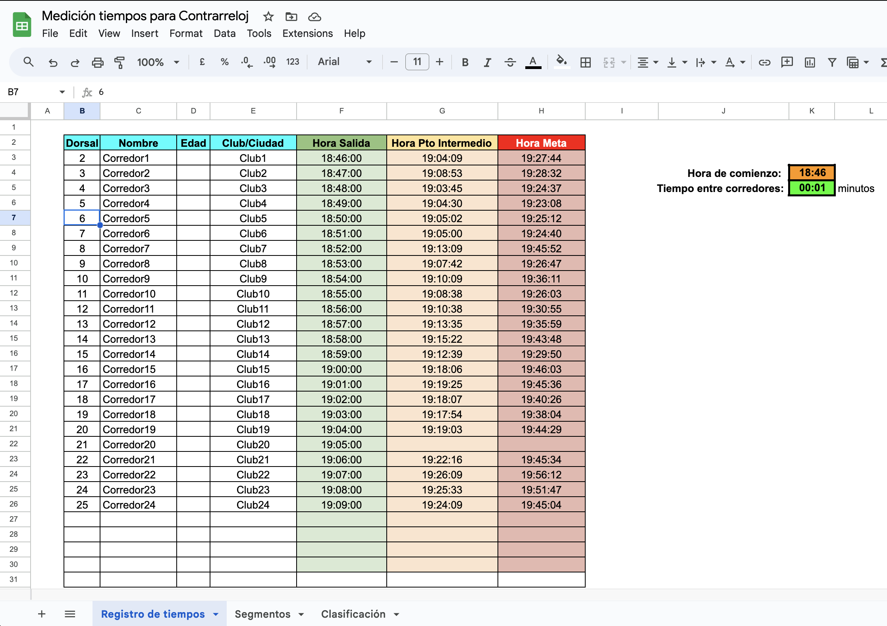
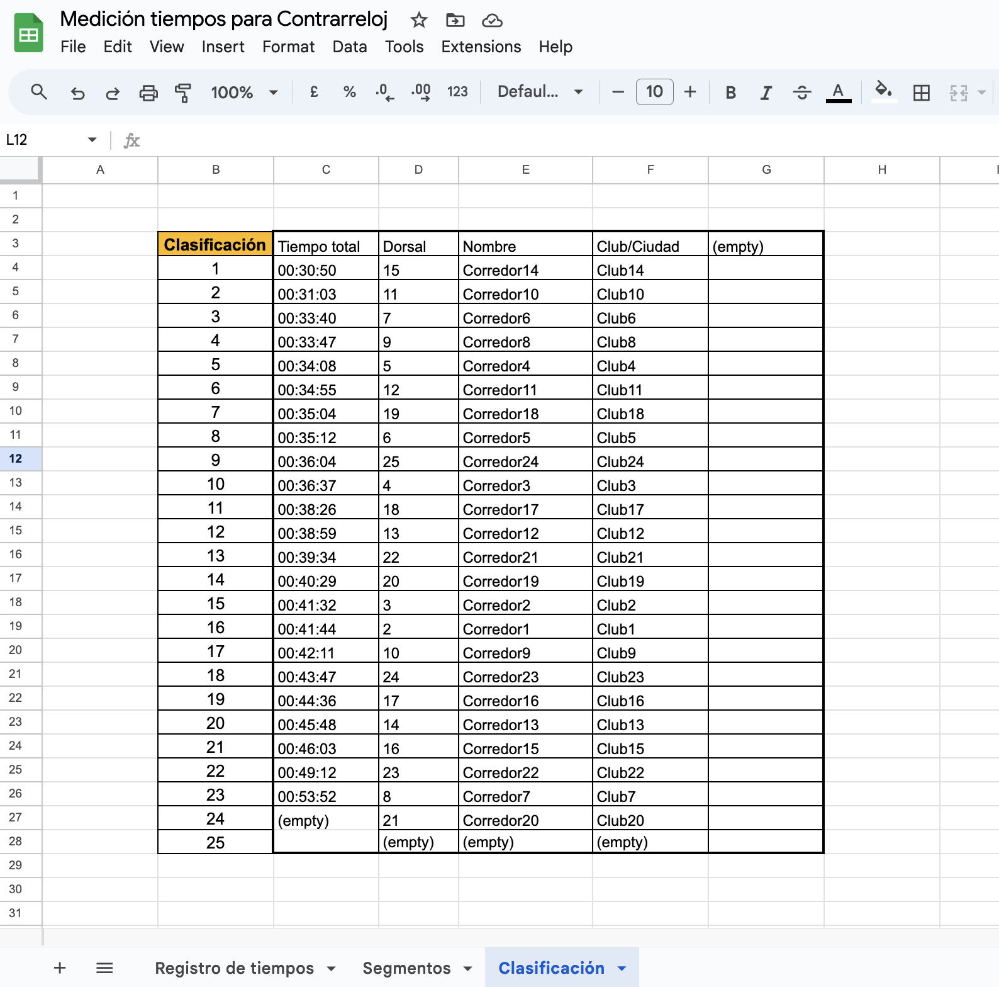
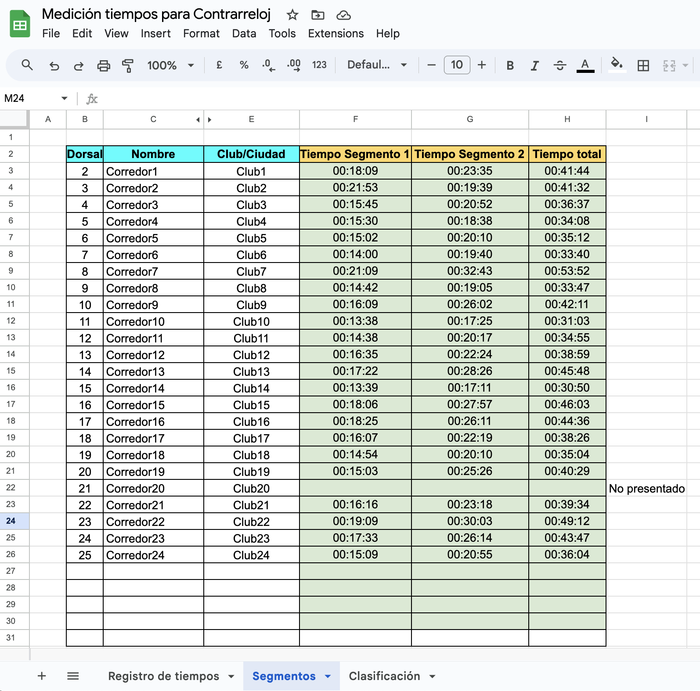

# Time Control for Cycling Time Trials / Control de Tiempos para Contrarreloj de Ciclismo

Example: https://docs.google.com/spreadsheets/d/1WyR_exUssD-gp5SXpRjEmRpnC5CJvkggv2fzYTZsKYM/edit?usp=sharing

## Hoja de registro de tiempos / Time Record Sheet

## Clasificación / Ranking

## Segmentos / Segments

# Español

Este documento permite realizar el control de tiempos en una contrarreloj de ciclismo u otros deportes. Se logra a través del registro de la hora de salida, hora de paso por un punto intermedio y hora de paso por la meta de los corredores. Se recomienda utilizar la hora del teléfono móvil con segundos para asegurar la precisión (asegurándose de usar la hora de la red).

## Cómo Funciona

### Registro de Tiempos

La primera hoja, llamada "Registro de tiempos", permite a los cronometradores introducir directamente las horas de paso de los corredores. También permite indicar la hora de salida del primer corredor y el intervalo de tiempo entre corredores.

### Segmentos

En la segunda hoja, llamada "Segmentos", se presentan los tiempos de los corredores divididos en segmentos: segmento 1, segmento 2 y tiempo total. Esta sección se puede editar fácilmente para añadir más segmentos según sea necesario.

### Clasificación

La pestaña "Clasificación" muestra la clasificación de la prueba en tiempo real a medida que se añaden los datos de los corredores. Esto proporciona una vista actualizada de los resultados.

## Uso y Licencia

Este documento ha sido creado utilizando Google Spreadsheet para la II Cronoescalada "Luis Narro" celebrada entre los pueblos de Valtablado - Alto de Ocentejo, el 19 de agosto de 2023.

La licencia de uso es abierta.

## English

# Time Control for Cycling Time Trials

This document enables time control for cycling time trials or other sports. It's achieved through the registration of departure time, intermediate checkpoint time, and finish line time for participants. It's recommended to use mobile phone time with seconds to ensure accuracy (ensuring network time is used).

## How It Works

### Time Registration

The first sheet, named "Time Registration," allows timekeepers to directly input passage times for participants. It also lets you indicate the departure time of the first participant and the time interval between participants.

### Segments

In the second sheet, named "Segments," participant times are displayed divided into segments: segment 1, segment 2, and total time. This section can be easily edited to add more segments as needed.

### Ranking

The "Ranking" tab displays the real-time ranking of the event as participant data is added. This provides an updated view of the results.

## Usage and License

This document has been created using Google Spreadsheet in the "II Cronoescalada 'Luis Narro'" event with the route from Valtablado to Alto de Ocentejo, on August 19, 2023.

The usage license is open.
